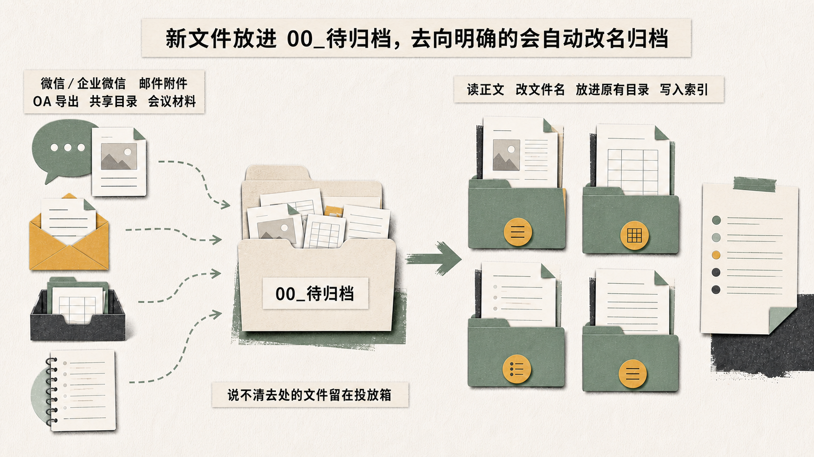
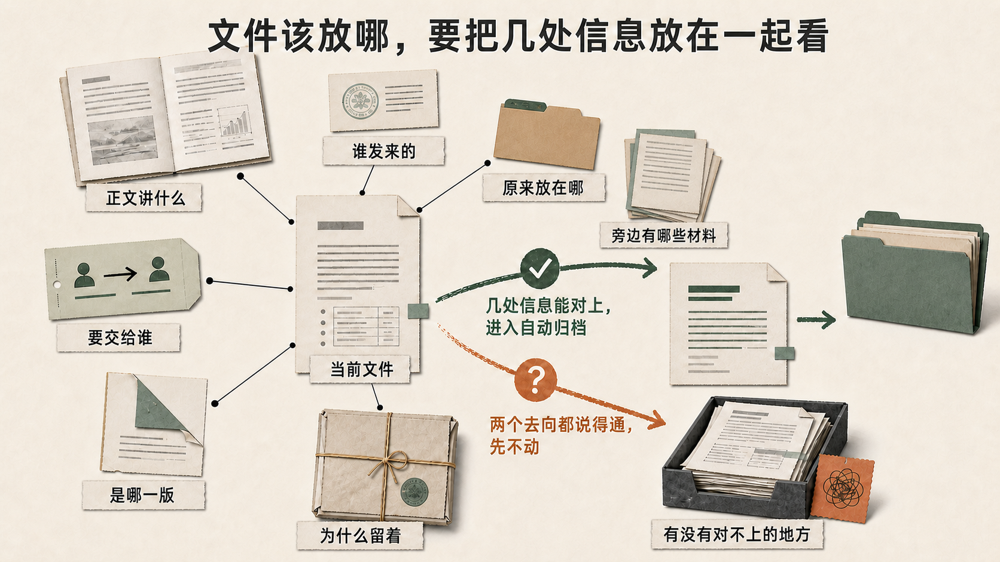
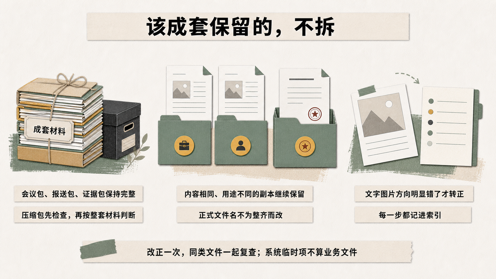

# organize-files-by-content

[](https://skills.sh/gegezi1205/organize-files-by-content)

Drop new files into `00_待归档`. After you approve the filing rules and enable the inbox, files that fit an approved rule are renamed, filed where you already look for them, and added to the index. Unclear files stay in the inbox.

把新文件放进 `00_待归档`。分类规则确认并启用投放箱后，去向明确的会自动改名、归档并写进索引；说不清去处的文件留在投放箱。

Current version: `1.5.1`

```bash
npx skills add gegezi1205/organize-files-by-content
```

Installs with the [skills CLI](https://skills.sh/) into your agent's skills directory. Installing only copies the files; the Skill does nothing until you ask your agent to use it, and it never touches a real folder without your confirmed preview. / 安装只是把文件放进 skills 目录，不会自动运行；整理真实文件夹前一定先经过你确认的完整预览。

> **Read the [disclaimer and safety notes](DISCLAIMER.md) before using real files. Keep a separate backup and start with a small folder.**
>
> Once you approve the full preview, the Skill can rename and move files. Deduplication needs separate approval. If two files have the same SHA-256 and serve the same purpose, the Skill may keep one and remove the other from its original location.
>
> **处理真实文件前，请先阅读[免责声明与安全提示](DISCLAIMER.md)，另存一份备份，并从小文件夹开始。**
>
> 完整预览经确认后，Skill 可以改名和移动文件。去重需要单独授权。两份文件如果 SHA-256 相同、用途相同，系统可能保留一份，从原位置移除另一份。

## English

### Put new files in one place

Work files turn up in chat, email, OA exports, shared folders, and meeting follow-ups. A few busy days are enough to fill the Desktop or Downloads folder with copies and half-finished names.

On the first run, the Skill looks at the folders and sample files you approve, then asks how you normally find old work: by project, task, person, or date. It uses those answers and the existing folder structure to draft filing rules for you to review. If the current folders already have a useful pattern, the rules keep it.

After you approve the rules and enable the inbox, drop new files into `00_待归档`. The organizer reads the document body and checks the title, author, date, current folder, and nearby files. Files that fit an approved rule are renamed, filed, and added to the index. If two destinations still make sense, the file stays in the inbox.



*New files enter through `00_待归档`. Files that fit an approved rule are filed; unclear files stay there.*

The filename is only one clue. The setup also considers who sent the file, who needs it, why it is being kept, where related material already lives, and whether any of those details conflict.



*The diagram lists the Chinese labels used during setup: body text, sender, recipient, current location, nearby files, reason for keeping it, version, and conflicting details.*

Meeting packs, submission packs, evidence sets, and archives stay together. Formal filenames stay unchanged when renaming would damage a reference or package.



*Packages stay intact, formal names are protected, text images are rotated only when one orientation produces clearly better OCR text, and each decision is recorded in the index.*

### How it decides where a file belongs

You can use the Skill on a Desktop, Downloads folder, existing work folders, personal reference material, or a shared folder where you have clear permission. Each location is reviewed and authorized on its own.

The Agent checks:

- the folders and naming habits already in use;
- the document body, its purpose, and the people or organizations involved;
- the title, author, and date stored in the document, plus any reliable date in the filename;
- the role of a file inside a package or established folder;
- details that point to a different destination.

A sender or author does not automatically determine the destination. The Agent also checks what the document is for, why it is kept, and what sits beside it. Repeating the same keyword does not count as extra evidence. A missing role-specific term does not by itself make a file an external reference.

If you separately allow media processing, ZIP and TAR archives are extracted with built-in safety checks, while 7Z and RAR use a detected `bsdtar` or 7-Zip tool. If the files in an archive belong together, the original archive and its folder structure stay together. If they point to different destinations, the whole archive waits for review. JPEG, PNG, and WebP text images are rotated only when one orientation produces clearly better OCR text. The corrected file is then renamed and hashed again.

The first questions take your job into account. The folder plan comes from the files, existing structure, and your answers.

For a top-level project, the Agent looks for a clear identity, related files or stages, and lasting value as a place to retrieve the work. Authorship counts as one clue.

Confirmed submissions, meeting packs, evidence packs, reports, exports, and runtime directories keep their names and internal structure. Their contents remain together.

The default naming pattern is:

`subject_or_project_specific_item_material_type_version_date.ext`

Your existing convention takes priority. The organizer looks for dates in the document or cover, then at the date stored inside the file, and finally in a reliable filename. It ignores file-system modification time when choosing a document date. Automatic names use month-level precision at most. Formal names remain unchanged when a rename could break a reference, package, or runtime dependency.

### A safe first run

1. Make a separate backup and open a few files from it.
2. Choose a small folder that represents the larger problem.
3. Confirm the locations, exclusions, ownership, and permitted actions.
4. Answer the short profile questions. The first list has 5 to 8 work types; request another 3 to 5 if needed.
5. Let the Agent inventory the approved scope in read-only mode.
6. Review every path, rename, version decision, and duplicate decision.
7. Resolve the open questions, approve the final preview, and verify the result.

Installation, configuration, monitoring, and a verified run on real files each require their own approval.

### Installation

This repository is the Skill folder. Follow the installation or import instructions for your Agent:

1. Download or clone this repository.
2. Keep the technical name and folder name `organize-files-by-content`.
3. Install or import the folder that contains `SKILL.md`.
4. Confirm that the Agent can find and invoke `$organize-files-by-content`.
5. Run the synthetic checks before granting access to real folders.

The files in `prompts/` provide product-neutral installation and usage guidance.

### Safety boundaries

Preview is the default. Before accepting `--apply`, the built-in organizer checks the profile, scope, permissions, full preview, and every open question. Execution requires an explicit confirmation.

One run may read, rename, move, write the index, and handle duplicates. The configuration therefore needs `read`, `rename`, `move`, and `deduplicate`. For a smaller permission set, remain in preview or ask the Agent to perform the approved actions without the built-in script.

Ambiguous, unsupported, encrypted, damaged, syncing, cloud-only, and unreadable files stay where they are with a recorded reason. An unreadable file blocks a completion report.

Archive extraction rejects absolute or escaping paths, links, special files, executable members, scripts, encryption, corruption, and fixed size limits. New schema 3 configurations use `00_待归档` and record separate authorization for archive extraction and text-image rotation. Existing schema 2 configurations keep their original inbox and continue to handle ordinary files without modifying media.

The built-in organizer does not delete unique files. Confirmed old versions move to the history area.

Deduplication follows a separate set of checks. The user must authorize `deduplicate`, confirm the full preview, and run `--apply`. Two files may merge when their SHA-256 values and purposes match. One copy remains; the other leaves its original location.

Formal submissions, meeting packs, evidence packs, reports, exports, reference sets, and runtime directories may need their own copies. A confirmed package boundary or relative path preserves them. Unclear cases stay in place for the user to decide.

Renaming or moving a file also makes its old path unavailable. The index and confirmed destination show where it went.

### One root per script run

`scripts/organizer.py` handles one configured root at a time. A `--file` outside that root is rejected.

Work across several roots needs an Agent with access to every approved location. The Agent prepares one complete preview, obtains confirmation, carries out the listed moves, and verifies the destinations. Each folder requires its own authorization.

### Monitoring

Background monitoring has its own approval. The inbox monitor runs for a confirmed root after you enable it. Login autostart also requires a successful real delivery test and a second confirmation. See `references/platform-automation.md`.

### Validation

Run these commands from the repository root:

```bash
python /path/to/skill-creator/scripts/quick_validate.py .
python scripts/self_test.py
python -m py_compile scripts/*.py
python -m json.tool evals/evals.json >/dev/null
```

The self-test uses temporary synthetic files and covers known regressions. Real folders still need a backup, preview, and review.

### Repository contents

```text
.
├── SKILL.md
├── VERSION
├── assets/
├── agents/
├── references/
├── scripts/
├── evals/
├── prompts/
├── README.md
├── DISCLAIMER.md
├── CHANGELOG.md
└── LICENSE
```

- `SKILL.md`: short public overview and the entry point for execution
- `assets/`: Chinese diagrams used on SkillHub and GitHub
- `agents/`: Agent display and invocation settings
- `references/organize-workflow.md`: complete workflow and safety rules
- `references/`: configuration and decision details
- `scripts/`: preview, organization, monitoring, and synthetic test tools
- `evals/`: evaluation prompts
- `prompts/`: product-neutral installation and usage guidance

### Version 1.5.1

Version `1.5.1` shortens the public overview, adds three Chinese diagrams, and moves the complete execution rules into `references/organize-workflow.md`. Organizer behavior, safety checks, and evaluations are unchanged. See [CHANGELOG.md](CHANGELOG.md).

### Contributing

Issues and pull requests are welcome. Please include a small synthetic example, the expected and actual behavior, and the checks you ran. Remove personal paths, organization names, credentials, and private documents before sharing anything.

---

## 中文

### 新文件放进 `00_待归档`

微信、邮件、OA 等处的材料，常常堆在桌面或下载目录。分类规则确认并启用投放箱后，新文件放进 `00_待归档`，去向明确的会自动改名、归档并写进索引；说不清去处的先留在投放箱。

第一次使用时，它先看现有目录和几份真实文件，再确认你平时按项目、事项、人员还是时间找东西。判断文件放哪，会一起看正文、谁发来的、要交给谁、为什么留着、原来放在哪、旁边有哪些材料、时间和版本，也会留意这些信息有没有互相打架。文件名和扩展名只占一小部分，现有目录有能用的规律就沿用，不另塞一套陌生目录。正式执行前，改名和去向会完整列出，确认后才动。

会议包、报送包、证据包和压缩包按整套材料处理；正式文件名不会为了整齐被改写。文字图片如果倒着或横着，会比较四个方向，只有其中一个读得明显更清楚才转正。两处都说得通的文件不动，等你选择。

### 整理时会看哪些信息

桌面、下载目录、长期使用的工作资料、个人参考资料和权限明确的共享文件夹都可以纳入整理。多个位置需要分别确认范围和权限。

Agent 先看原有目录和命名习惯，再读文件名、正文，以及文件本身保存的标题、作者和日期。材料中出现单位名称时，还要分清它是作者、发起方、接收方，还是文中提到的业务对象。日期依次取自正文或封面、文件本身保存的日期和可靠的原文件名。

判断时会把几件事分开：谁发来的、正文讲什么、要交给谁、这份材料为什么要留、原来放在哪、旁边有哪些文件、是哪一版，以及这些信息有没有互相对不上。一个关键词重复出现几次，不会因此变成几条理由；没写岗位术语，也不等于只是外部参考。

得到单独的媒体处理授权后，ZIP、TAR、7Z、RAR 会先按安全边界解压，再逐个读取包内主要文件。整包材料指向同一件事时，保留原压缩包和相对结构一起归档；内容指向两个不同去处时，整包等待选择。JPEG、PNG、WebP 会比较四个方向的文字识别结果，只有优势明确时纠正方向，并按旋转后的内容重新命名、计算大小和哈希。

内容相同的文件也要查看各自所在的位置。会议包、证据包或报送包里的副本通常承担着结构和留痕作用，整理时会按材料包用途保留。

开头会问职业和岗位，这样第一轮选项更贴近实际。接下来的目录安排，以文件用途、原有习惯和使用者选择为准。一级项目要不要建，还要看材料是否成组、是否有阶段记录，以及以后会不会按项目查找。

已经确认的正式提交包、会议包、证据包、报送包、导出包和程序运行目录会保留原名称与内部结构，包内文件继续放在一起。

文件名通常按下面的顺序组合：

`主题或项目_具体事项_材料性质_版本_日期.ext`

已有命名习惯优先。材料日期从正文或封面开始查找，其次是文件本身保存的日期和可靠的原文件名。文件系统的修改时间不参与材料日期判断，自动命名最多写到月份。涉及引用、材料包结构或程序依赖时，文件继续使用原来的正式名称。

### 第一次使用

1. 另存一份备份，并从备份中打开几份文件。
2. 选一个有代表性的小文件夹试用。
3. 确认整理位置、排除内容、文件夹归属和允许的操作。
4. 回答几个简短的工作情况问题。第一轮有 5 至 8 个工作类型选项，有遗漏时再补充 3 至 5 个。
5. 让 Agent 只读查看已经确认的范围。
6. 在完整预览中核对路径、改名、版本和重复文件处理。
7. 处理完待确认事项，批准最终预览，再检查执行结果。

安装、生成配置、启用监控和真实执行都需要单独确认。

### 安装

本仓库就是 Skill 文件夹。请按所使用 Agent 的方式安装或导入：

1. 下载或克隆本仓库；
2. 保留技术名称和文件夹名 `organize-files-by-content`；
3. 安装或导入包含 `SKILL.md` 的文件夹；
4. 确认 Agent 能发现并调用 `$organize-files-by-content`；
5. 开放真实文件夹前，先运行合成数据校验。

`prompts/` 提供不绑定具体产品的安装和使用说明。

### 安全边界

默认先预演。一体化整理器在接受 `--apply` 前，会检查工作情况、整理范围、权限和完整预览，并确认待选择事项已经处理完。执行还需要明确确认。

一次执行可能包含读取、改名、移动、写入索引和处理重复文件，所以配置需要同时允许 `read`、`rename`、`move` 和 `deduplicate`。如果只授权其中几项，可以继续预演，也可以让 Agent 绕开一体化脚本，按预览执行已经允许的操作。

遇到用途不明或无法读取的文件，整理器会让它留在原处，并在索引中记下原因。加密、损坏、正在同步、尚未下载到本地以及当前不支持的格式，也按同样方式处理。存在无法读取的文件时，任务会标为未完成。

压缩包会拒绝绝对路径、路径穿越、链接、特殊文件、程序脚本、可执行成员、加密、损坏和固定安全上限。schema 3 新配置默认使用 `00_待归档`，并单独记录解压和文字图片旋转授权；已有 schema 2 配置继续沿用原投放箱并处理普通文件，未补授权前不修改媒体。

内置整理器不会删除独有文件。关系明确并经过确认的旧版本会移入历史区。

执行去重时，使用者需要明确授权 `deduplicate`，核对完整预览，再运行 `--apply`。两份文件的 SHA-256 和用途都相同，系统可能保留其中一份，并从原位置移除另一份。

正式提交包、会议包、证据包、报送包、导出包、参考资料和程序运行目录中的副本可能各有用途。系统会根据已确认的材料包边界或相对路径保留这些副本。用途尚未确认时，两份文件都留在原处。

改名或移动会使旧路径失效。索引和预览中确认的目标位置可以用来查找文件。

### 单个根目录与多个位置

`scripts/organizer.py` 每次处理配置中指定的一个根目录，根目录外的 `--file` 会被拒绝。

跨多个根目录整理时，Agent 需要访问全部授权位置，先生成覆盖所有位置的完整预览，再按确认结果逐项执行并检查目标位置。每个来源目录都要单独授权。

### 后台监控

后台监控需要另行开启。投放箱监控按已经确认的根目录设置。登录自启动还要先完成一次真实投递测试，并再次确认。具体要求见 `references/platform-automation.md`。

### 校验

在仓库根目录运行：

```bash
python /path/to/skill-creator/scripts/quick_validate.py .
python scripts/self_test.py
python -m py_compile scripts/*.py
python -m json.tool evals/evals.json >/dev/null
```

自测使用临时合成文件，覆盖已经发现的回归问题。真实资料仍需备份、预演和人工核对。

### 仓库内容

```text
.
├── SKILL.md
├── VERSION
├── assets/
├── agents/
├── references/
├── scripts/
├── evals/
├── prompts/
├── README.md
├── DISCLAIMER.md
├── CHANGELOG.md
└── LICENSE
```

- `SKILL.md`：简短公开概述和执行入口
- `assets/`：SkillHub 与 GitHub 使用的中文说明图
- `agents/`：Agent 的显示与调用配置
- `references/organize-workflow.md`：完整流程与安全规则
- `references/`：配置与判断细则
- `scripts/`：预演、整理、监控和合成自测工具
- `evals/`：评测提示
- `prompts/`：不绑定具体产品的安装与使用说明

### 1.5.1 版本

`1.5.1` 精简公开概述，增加三张中文说明图，并把完整执行规则移到 `references/organize-workflow.md`。整理脚本、安全检查和评测均未改变。详见 [CHANGELOG.md](CHANGELOG.md)。

### 贡献方式

欢迎提交 Issue 或 Pull Request。请附上小型合成样本、预期与实际结果，以及已经运行的检查。分享前请清除个人路径、单位名称、凭据和私人文档。
